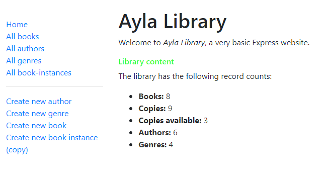

# Ayla-library

This is a basic local library website that shows examples of different available features on Express.

It is built by following the [tutorial example](https://developer.mozilla.org/en-US/docs/Learn/Server-side/Express_Nodejs/Introduction) on the Mozilla Developer Network

## Screenshot of the final result

## Technologies Used

1. [Express Application Generator](https://expressjs.com/) tool to create a skeleton website and application
2. [Node.js](https://nodejs.org/) as a server
3. [Mongodb](https://www.mongodb.com/cloud/atlas) as database to store website's data.
4. [Pug](https://pugjs.org/) as a template ("views") to render the data as HTML to be displayed in the browser
5. [Heroku](https://heroku.com/) : Deploy the application to production
6. [nodemon](https://www.npmjs.com/package/nodemon) to automatically restart the node application when file changes in the directory are detected

## Online Link
[visit this link](https://ayla-local-library.herokuapp.com/catalog)
## Available opperation :

- List all books
- List all authors
- List all copies of a book
- List all exsiting genre
- Create new author-book-copy and genre
- Update exsiting author-book-copy and genre
- Delete exsiting author-book-copy and genre

## How to use

1. clone the repository
2. run npm install
3. run npm start and check 'localserver:3000' in your browser
